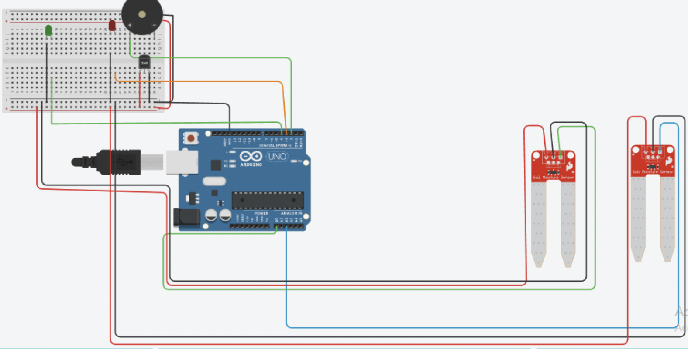

# Smart Plant Incubator

**Author:** Sara El Bari  
**University:** Western Brittany University (UBO)
**Academic Year:** 2022 – 2023, 2nd year of Bachelor of Degree

>> A smart, self-regulating plant incubator capable of monitoring and maintaining optimal environmental conditions for plant growth.  
It measures **temperature**, **humidity**, **soil moisture**, and **water tank level**, and automatically manages **watering**, **drainage**, and **alerts**.
Using low-cost sensors and Arduino-based logic to monitor and care for indoor plants like *Pilea peperomioides*.
---

## Overview:

This project demonstrates a smart, self-regulating plant incubator capable of monitoring:

-  **Temperature & Humidity**
-  **Soil Moisture**
-  **Water Tank Level**

And automatically managing:

-  **Watering via Pump**
-  **Water Drainage via Valve**
-  **Alerts via LEDs & Buzzer**

It is powered by an **Arduino Uno**, uses basic electronics components, and provides a strong foundation for future IoT or ML-enabled smart agriculture systems.

## Project Goals:

- Create a **controlled micro-environment** for plant growth.
- Maintain optimal **temperature**, **soil humidity**, and **moisture balance**.
- Use **sensor feedback** to automate watering and drainage.
- Provide **real-time alerts** for water shortage or system issues.

## System Design

### Physical Structure:

| Dimension | Value        |
|----------|--------------|
| Length    | 28–30 cm     |
| Width     | 35–36 cm     |

### Plant Target:

- **Species:** *Pilea peperomioides*
- **Ideal temp:** 8°C to 20°C  
- **Moisture:** Slightly wet soil (2 waterings/week)  
- **Light:** Indirect sunlight

## Hardware Components:

| Component | Description |
|----------|-------------|
| Arduino Uno | Main controller |
| DHT11 | Temperature & humidity sensor |
| Soil Moisture Sensor V1.2 | Measures soil humidity |
| Water Level Sensor | Detects reservoir level |
| Mini Submersible Pump | Pumps water into soil |
| Water Valve (5V Relay controlled) | Empties excess water |
| Green LED | Indicates normal operation |
| Red LED | Signals fault |
| Buzzer | Alerts for dry tank or errors |
| Fan | Ensures even temperature |
| 2x 5V Relays | Switches for pump and valve |
| Breadboard | Circuit prototyping |

## Circuit Overview:

- Sensors → Analog/Digital pins on Arduino
- Relays → Switch pump/valve based on sensor data
- LEDs + Buzzer → Give user feedback
- Powered via 5V battery + optional external supply for fan

**Pin Mapping Summary:**

| Pin | Function |
|-----|----------|
| A0  | Water Level Sensor |
| A2  | Soil Moisture Sensor |
| D2  | Buzzer |
| D3  | Red LED |
| D4  | Green LED |
| D5  | DHT11 Sensor (if connected) |
| D6  | Valve Relay |
| D7  | Pump Relay |

## Program Logic:

- If the **soil is dry** and **reservoir has water**, pump activates  
- If **reservoir is empty**, buzzer + red LED turn on  
- If **reservoir is full**, system drains water via valve  
- Fan runs continuously via external power

## Project Photos

### System Overview

## System Diagrams

### Full Circuit Wiring (Tinkercad)

---

### Water Valve Control System

> Solenoid valve connected to external power via a 5V relay, triggered by the Arduino Uno.

---

### Water Pump Control System

> Mini 5V submersible pump powered by an external battery and controlled via relay on digital pin 7.

## Project Status

- Functional prototype  
- Could be extended with Wi-Fi or app control using ESP32  
- Future version may include ML-based moisture prediction
- Data logging (SD or cloud)  
---

## Author

**Sara (2025)**  
[GitHub Profile](https://github.com/Saghaaah1)

---

## License
This project is licensed under the [MIT License](LICENSE).
